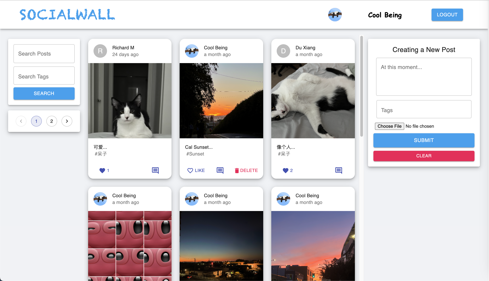

# MERN Project: SocialWall


A full stack social application using MERN stack. 

## Link (deployed w/ free tier Heroku, may take a while to load content): 
https://social-wall.netlify.app/


# Demo

## Home View:


## Main Page:
PC view            |  Mobil View
:-------------------------:|:-------------------------:
  |  

## Recommendation:


## Comment System:


# Key Features
- Friendly UI for unique users
- Guest browsing mode
- Responsive Design, universal support for all sized phone screens or PCs
- Support Google Oauth2.0 with the lastest authentication system.
- Native login, signup support with MongoDB backend.
- Support comments.
- Recommendation system
- Seach by tags support


# Technologies

## Frontend

- [axios](https://github.com/axios/axios)
- [http-proxy-middleware](https://github.com/chimurai/http-proxy-middleware)
- [React](https://reactjs.org/)
- [Redux](https://redux.js.org/)
- [Redux-Thunk](https://github.com/reduxjs/redux-thunk)

## Backend

- [nodejs](https://nodejs.org/en/)
- [express](https://gulpjs.com/)
- [mongodb](https://webpack.js.org/concepts/)

Check `package.json` file for more information.

# Getting Started

Follow the instructions below to set up the environment and run this project on your local machine. Note that you should setup your MongoDB Atlas Cluster first to get your database. 

1. Clone this repository.

```bash
# Clone repository
$ git clone https://github.com/xd00099/SocialWall.git
```

2. Install dependencies via NPM or Yarn

```bash
# Install dependencies via npm
$ cd client
$ npm install

$ cd server
$ npm install
```

3. Run the client and server.

```bash
# Run server
$ cd client
$ npm start

$ cd server
$ npm start
```

# Acknowledgement

The code template was developed from JavaScriptMastery on YouTube.
