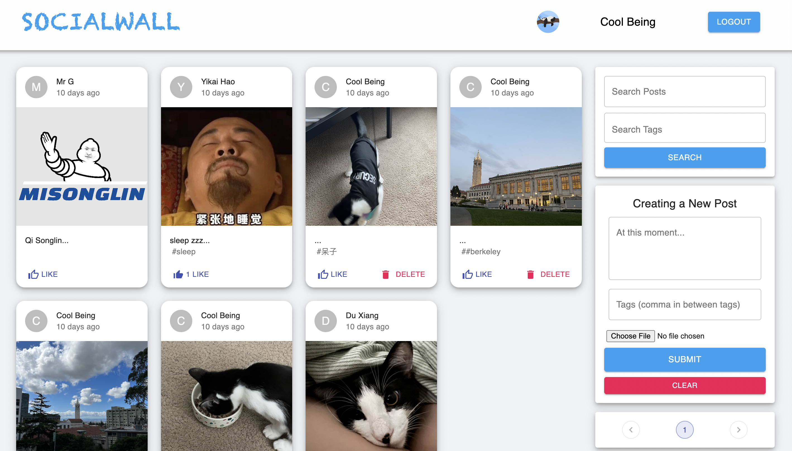
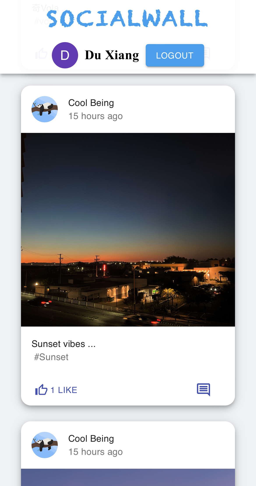
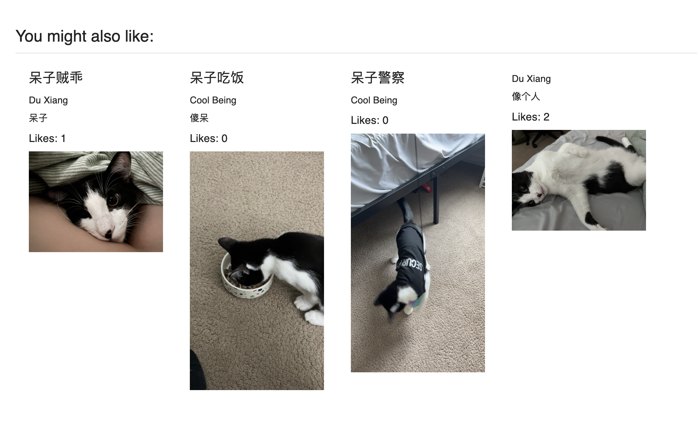
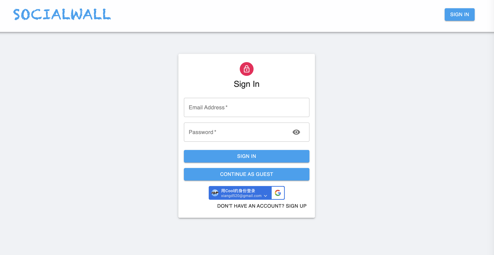
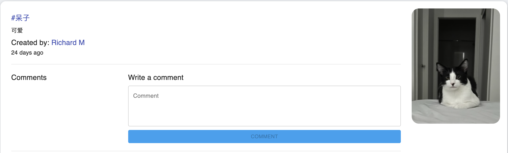

# SocialWall

## Link (deployed w/ free tier Heroku, may take a while to load content): 

https://social-wall.netlify.app/

A full stack social application using MERN stack.

## Key features:
- Friendly UI for unique users
- Guest browsing mode
- Responsive Design, universal support for all sized phone screens or PCs
- Support Google Oauth2.0 with the lastest authentication system.
- Native login, signup support with MongoDB backend.
- Support comments.
- Recommendation system
- Seach by tags support

## Demo

### Overall UI:
PC view            |  Mobil View
:-------------------------:|:-------------------------:
  |  

### Recommendation:

### Login System:

### Comment System:

